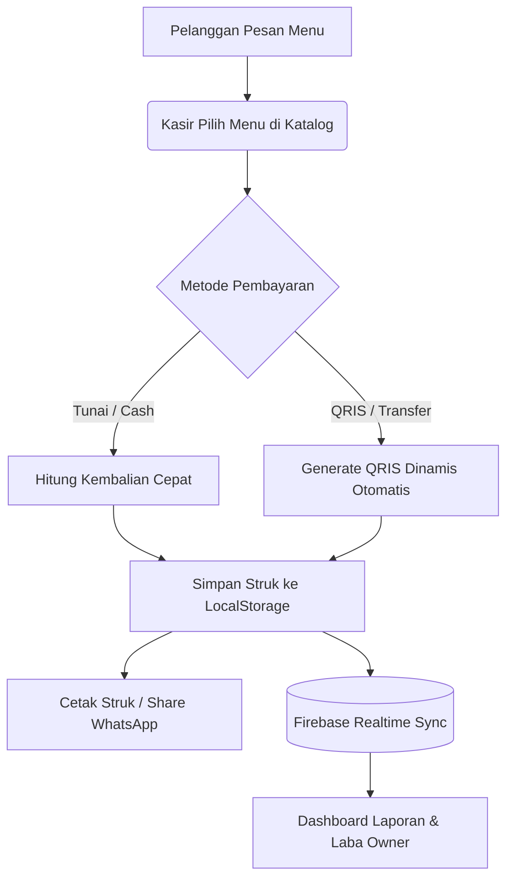

# 🏪 Aristotle POS (Kasir Mami)

[](file:///index.html)
[](file:///js/firebase.js)
[](file:///js/app.js)
[](file:///LICENSE)

Aplikasi kasir (Point of Sale) modern, ringan, dan siap pakai langsung di browser tanpa instalasi rumit. Dirancang khusus untuk warung makan, kedai kopi, dan pelaku UMKM agar pencatatan transaksi jadi cepat, akurat, dan ramah untuk semua usia (termasuk lansia).

---

> [!TIP]
> **Bisa Dipakai Offline & Online!**
> Transaksi kasir tetap jalan lancar meski internet mati berkat teknologi *Offline-First* LocalStorage + Service Worker PWA. Saat internet nyala kembali, data otomatis tersinkron ke Cloud Firebase.

---

## ✨ Fitur Utama

- [x] **Multi-Antrian Pesanan (*Order Queues*):** Layani banyak pelanggan sekaligus (Pesanan #1, #2, Meja 5) tanpa takut pesanan tertukar.
- [x] **QRIS Dinamis Otomatis:** Ubah QRIS statis warung jadi QRIS dinamis yang otomatis ada nominal tagihan & CRC valid. Pelanggan tinggal scan tanpa repot ketik nominal.
- [x] **Multi-Tenant & Proteksi PIN Toko:** Satu aplikasi bisa dipakai banyak toko/cabang. Setiap toko diamankan dengan 4-digit PIN kasir.
- [x] **Realtime Cloud Sync:** Data menu, stok, dan struk tersinkron instan antar HP kasir dan laptop owner via Google Firestore.
- [x] **UI/UX Ramah Lansia:** Tombol sentuh ekstra besar, stepper porsi `[-]` dan `[+]` langsung di kartu menu, suara ketukan taktil instan, dan panduan interaktif beranimasi (*Spotlight Tour*).
- [x] **Laporan Keuangan & Laba Bersih:** Hitung otomatis omzet kotor, pengeluaran modal belanja, dan profit bersih harian/bulanan.

---

## 🧭 Alur Kerja Sistem



---

## 📁 Struktur Folder Proyek

```text
UMKM Mami/
├── index.html           # Struktur UI utama (POS, Laporan, Kelola Menu, Modal Auth)
├── manifest.json        # Konfigurasi PWA (Install to Homescreen)
├── sw.js                # Service Worker (Cache aset offline)
├── css/
│   └── style.css        # Animasi kustom, Spotlight Mask, & utilitas CSS
└── js/
    ├── app.js           # Orkestrator utama, routing view, & event listeners
    ├── state.js         # Pengelola state lokal, keranjang, & multi-tenant storage
    ├── config.js        # Konfigurasi default, storage keys, & fallback data
    ├── firebase.js      # Integrasi Firebase Firestore SDK & Realtime Listener
    ├── qris.js          # Parser TLV & generator QRIS dinamis standar EMVCo
    ├── utils.js         # Format Rupiah, Web Audio haptic click, toast, dialog
    └── modules/
        ├── pos.js       # Logika antrian, render katalog menu, & keranjang
        ├── payment.js   # Kalkulasi uang kembalian, QRIS generator, struk thermal
        ├── admin.js     # Manajemen menu, harga, kategori, & kontrol stok
        ├── report.js    # Laporan laba/rugi, filter tanggal, export data
        └── tour.js      # Spotlight Tour interaktif pemandu fitur kasir
```

---

## 🚀 Cara Menjalankan

Tidak perlu install framework berat (Node.js/React build step). Cukup jalankan web server lokal sederhana:

### Opsi 1: Pakai Live Server (VS Code / Antigravity)
1. Buka folder proyek di editor.
2. Klik kanan pada [index.html](file:///index.html) $\rightarrow$ **Open with Live Server**.
3. Akses melalui browser di `http://127.0.0.1:5500`.

### Opsi 2: Pakai Python
```bash
python -m http.server 8000
```
Buka browser di `http://localhost:8000`.

---

## 🔐 Keamanan Multi-Tenant & Berbagi Link

> [!IMPORTANT]
> **Bagikan Link Toko ke Karyawan:**
> Anda bisa membagikan link kasir dengan format `https://domain.com/?store=nama_toko`.
> 
> Saat link dibuka di HP staf baru, sistem **TIDAK** langsung membuka kasir secara bebas, melainkan mewajibkan input **4 digit PIN** toko terlebih dahulu untuk menjamin keamanan data transaksi.

---

## ⌨️ Shortcut Keyboard Kasir

| Tombol | Fungsi |
| :--- | :--- |
| <kbd>F2</kbd> | Buka Antrian Pesanan Baru |
| <kbd>F4</kbd> | Langsung Buka Pembayaran (Checkout) |
| <kbd>Esc</kbd> | Tutup Modal / Batalkan Dialog |
| <kbd>Ctrl</kbd> + <kbd>P</kbd> | Cetak Struk Belanja Kasir |

---

## 📄 Lisensi

Proyek ini dirilis di bawah lisensi [MIT](file:///LICENSE). Bebas digunakan dan dimodifikasi untuk kebutuhan UMKM dan bisnis Anda.
