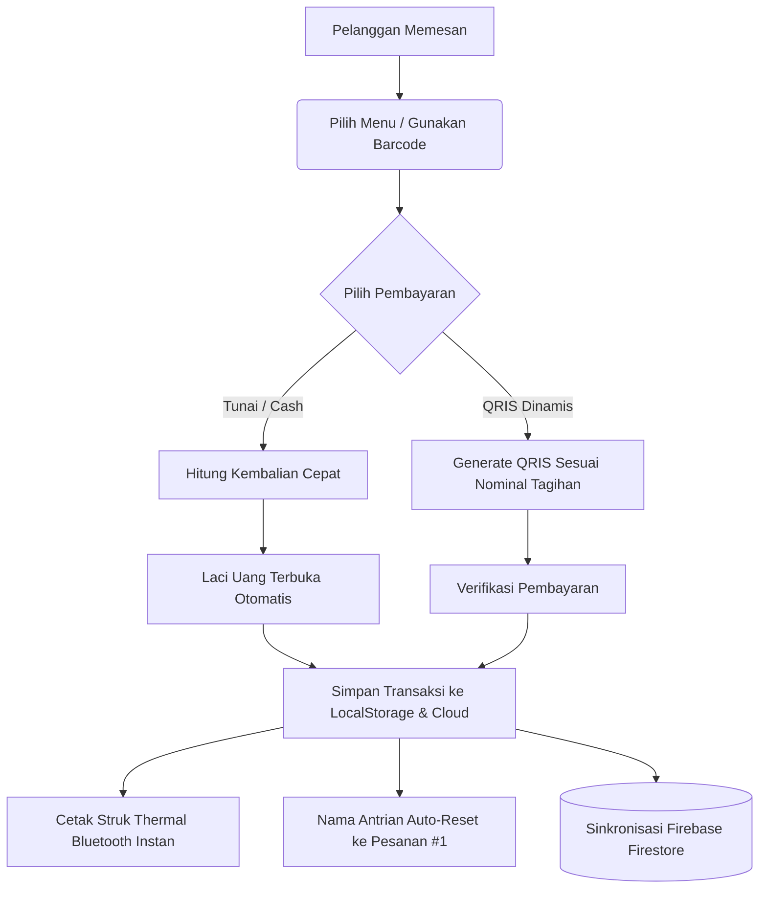

# 🎓 Aristotle POS (v1.1.3)
### *Sistem Kasir Pintar, Modern, dan Skalabel untuk UMKM Multi-Tenant*

[](https://github.com/miezlearning/umkm-prototype/releases)
[](file:///Aristotle-POS.apk)
[](file:///index.html)
[](file:///js/firebase.js)
[](file:///LICENSE)

**Aristotle POS** adalah aplikasi kasir (*Point of Sale*) multi-platform yang dirancang khusus untuk mempermudah operasional UMKM, warung makan, kedai kopi, dan bisnis retail. Dibangun dengan pendekatan **Hybrid Modern** (Web PWA + Native Android App), aplikasi ini ringan, bekerja 100% saat offline, dan otomatis tersinkronisasi ke cloud saat online.

---

## 📜 Riwayat Pembaruan (Changelog)

### 🍳 Versi 1.1.3 — *Kitchen Ticket Checkpoint & Smart Automation* (Terbaru)
* **Tiket Dapur / Kitchen Checkpoint Resmi:**
  * Menambahkan format cetak khusus lembar kerja koki / barista dengan kotak centang `[  ]` di setiap item pesanan agar koki bisa langsung mencentang menu yang sudah dimasak.
  * Menghilangkan seluruh nominal harga di struk dapur untuk meminimalkan distraksi tim dapur dan menghemat kertas thermal 58mm.
  * Menampilkan **Nomor Meja / Antrian Ekstra Besar** di bagian atas lembar tiket.
* **Tombol Cepat `Tiket Dapur 🍳` di Layar Transaksi:**
  * Kasir dapat mencetak atau mencetak ulang tiket antrian koki kapan saja dengan 1 kali klik.
* **Otomatisasi Cetak Ganda (*Smart Double Print*):**
  * Opsi di Pengaturan Printer untuk otomatis mencetak Tiket Dapur terlebih dahulu, lalu mencetak Struk Pelanggan secara berurutan saat transaksi selesai.
* **Tombol Uji Coba Mandiri:** Menambahkan tombol **"Tes Dapur"** di modal pengaturan printer untuk mempermudah pratinjau fisik kertas thermal.

---

### 🖨️ Versi 1.1.2 — *VSC Thermal Printer Recovery & Buffer Fix*
* **Fix Lockup Mode Grafik (VSC TM-58V):** Menyuntikkan perintah `ESC @` (`0x1B, 0x40`) dan `ESC t 0` (`0x1B, 0x74, 0x00`) segera setelah data raster logo selesai dicetak, memaksa printer keluar dari mode grafik dan kembali mencetak seluruh teks transaksi.
* **Optimalisasi Dimensi Logo (160 dot):** Memangkas ukuran logo bitmap dari 240 dot menjadi 160 dot, menghemat 70% memori buffer dan mencegah printer VSC macet (*hang*) di tengah gambar.
* **Pacing Thermal Bluetooth 25ms:** Menyesuaikan jeda transmisi data Bluetooth per 256-byte menjadi 25ms agar jarum pemanas (*thermal print head*) memiliki waktu cukup membakar titik hitam tanpa data terpotong.

---

### ⚡ Versi 1.1.1 — *Zero-Delay Bluetooth & 58mm Tail Feed*
* **Persistent Bluetooth Socket:** Menggunakan soket RFCOMM aktif yang terus terhubung di latar belakang, memangkas latensi cetak kedua dan seterusnya menjadi instan (< 10ms).
* **Pre-Connect Warmup:** Inisialisasi koneksi Bluetooth printer otomatis saat aplikasi pertama kali dibuka.
* **5-Line Tail Feed:** Mengganti pemotong otomatis (*auto-cut*) dengan umpan 5 baris kertas (`ESC d 5` + baris baru) khusus printer 58mm agar struk melewati pisau gerigi perobek dengan rapi tanpa terpotong teksnya.

---

### 🎓 Versi 1.1.0 — *Aristotle Rebranding & Native Core*
* **Rebranding Resmi:** Mengganti identitas menjadi **Aristotle POS** (`com.aristotle.pos`) dengan maskot kucing bertoga sarjana transparan 100%.
* **Smart External Link Interceptor:** Tautan WhatsApp (`wa.me`) otomatis meluncurkan aplikasi native WhatsApp Android resmi.
* **Locked Keystore:** Mengunci sertifikat rilis debug Android agar update APK tidak pernah mengalami *Package Conflicting Error*.
* **Otomatisasi CI/CD:** Auto-increment `versionCode` dan publikasi APK otomatis melalui GitHub Actions & GitHub Releases.
* **Inline Failsafe:** Menghilangkan risiko macet (*stuck*) pada splash screen pembuka.

---

## ✨ Fitur Utama Aristotle POS

| Fitur | Deskripsi |
| :--- | :--- |
| **Multi-Antrian (*Order Queues*)** | Layani banyak meja/pesanan sekaligus tanpa risiko pesanan tertukar |
| **QRIS Dinamis Standar EMVCo** | Ubah QRIS statis toko menjadi QRIS dinamis otomatis dengan nominal tepat & validasi CRC |
| **Multi-Tenant & PIN Keamanan** | Satu aplikasi mendukung banyak toko/cabang terpisah dengan proteksi 4-digit PIN |
| **Realtime Cloud Sync** | Sinkronisasi instan antar HP kasir dan laptop owner menggunakan Firebase Firestore |
| **Offline-First Resilience** | Transaksi tetap berjalan normal tanpa internet; data tersimpan lokal dan sync saat online |
| **Laporan Finansial & Profit** | Rekap otomatis omzet, modal belanja, laba bersih, dan ekspor riwayat transaksi |
| **UI Lansia-Friendly** | Tombol sentuh besar, kontras tinggi, stepper porsi langsung di kartu menu, dan efek haptic audio |

---

## 🧭 Alur Kerja Sistem Kasir



---

## 📁 Struktur Proyek

```text
UMKM Mami/
├── index.html                   # Halaman utama POS, Laporan, Admin, & Modal UI
├── manifest.json                # Web App Manifest (PWA Homescreen Install)
├── sw.js                        # Service Worker untuk caching aset offline
├── Aristotle-POS.apk            # File installer native Android terbaru
├── android/                     # Proyek Native Android Studio (Java 17, SDK 34)
│   ├── app/build.gradle         # Konfigurasi appId, compileSdk, versionCode & signing
│   └── src/main/
│       ├── AndroidManifest.xml  # Izin Bluetooth, Kamera QRIS, & Akses File
│       ├── java/com/aristotle/pos/MainActivity.java  # WebView, SPP Bluetooth Bridge, Intent Routing
│       └── res/mipmap-*/        # Paket ikon maskot Android (MDPI s/d XXXHDPI)
├── css/
│   └── style.css                # Gaya kustom, cetak struk 58mm, & animasi modal
├── js/
│   ├── app.js                   # Orkestrator aplikasi & inisialisasi lifecycle
│   ├── state.js                 # State management lokal & antrian aktif
│   ├── config.js                # Pengaturan default & helper key storage
│   ├── firebase.js              # Integrasi Cloud Firestore & sinkronisasi realtime
│   ├── qris.js                  # Generator QRIS dinamis EMVCo
│   ├── utils.js                 # Format Rupiah, toast pemberitahuan, haptic audio
│   └── modules/
│       ├── pos.js               # Antrian pesanan, katalog produk, kalkulasi keranjang
│       ├── payment.js           # Checkout pembayaran, dialog cetak, reset antrian
│       ├── printer.js           # Driver Bluetooth SPP, ESC/POS generator, & cash drawer
│       ├── admin.js             # Pengelolaan produk, kategori menu, & kontrol stok
│       └── report.js            # Laporan keuangan, omzet, & laba rugi
└── .github/workflows/
    └── ci-cd.yml                # CI/CD otomatis untuk deploy Pages & build APK rilis
```

---

## 📲 Cara Instalasi & Menjalankan

### Cara 1: Pasang di HP Android (Aplikasi Native)
1. Unduh file **[Aristotle-POS.apk](file:///Aristotle-POS.apk)** langsung ke HP Android Anda.
2. Buka file APK dan izinkan instalasi dari sumber tidak dikenal jika diminta.
3. Buka aplikasi **Aristotle POS** di homescreen Anda.

### Cara 2: Buka di Browser (PWA)
Buka tautan rilis publik di browser HP / Laptop Anda:
```text
https://miezlearning.github.io/umkm-prototype/
```
*(Tekan **"Tambahkan ke Layar Utama" / "Install App"** di menu browser untuk menjadikan aplikasi desktop/HP)*

### Cara 3: Menjalankan di Lokal (Development)
Jalankan web server lokal sederhana (misal menggunakan Python):
```bash
python -m http.server 8000
```
Buka browser di `http://localhost:8000`.

---

## ⚡ Portal Super Admin (Monitoring Toko)

Untuk memantau performa seluruh UMKM mitra dari satu tempat:
* Akses URL: `https://domain.com/?view=superadmin`
* **Kemampuan Portal:**
  * Memantau omzet harian & jumlah transaksi seluruh UMKM secara terpusat.
  * Reset PIN toko jika mitra lupa.
  * Masuk ke kasir cabang manapun tanpa input PIN (*One-Click Impersonate*).

---

## ⌨️ Pintasan Keyboard Kasir (Desktop / Laptop)

| Tombol | Fungsi |
| :--- | :--- |
| <kbd>F2</kbd> | Tambah Antrian Pesanan Baru |
| <kbd>F4</kbd> | Buka Halaman Pembayaran (Checkout) |
| <kbd>Esc</kbd> | Tutup Jendela Modal / Batalkan Dialog |
| <kbd>Ctrl</kbd> + <kbd>P</kbd> | Cetak Ulang Struk Kasir |

---

## 📄 Lisensi

Hak Cipta © 2026 **Aristotle POS Team**.  
Dirilis di bawah lisensi [MIT License](file:///LICENSE). Bebas digunakan dan dikembangkan untuk memajukan UMKM Indonesia.
