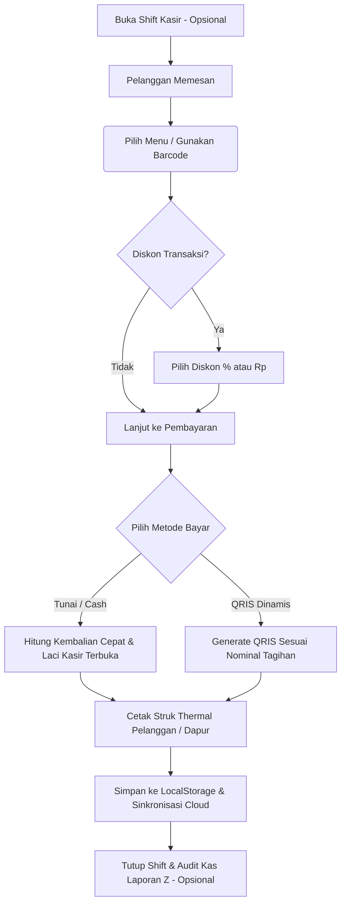

# 🎓 Aristotle POS (v1.2.0)
### *Sistem Kasir Pintar, Modern, dan Skalabel untuk UMKM Multi-Tenant*

[](https://github.com/miezlearning/umkm-prototype/releases)
[](Aristotle-POS.apk)
[](index.html)
[](js/firebase.js)
[](LICENSE)

**Aristotle POS** adalah aplikasi kasir (*Point of Sale*) multi-platform yang dirancang khusus untuk mempermudah operasional UMKM, warung makan, kedai kopi, dan bisnis retail. Dibangun dengan pendekatan **Hybrid Modern** (Web PWA + Native Android App), aplikasi ini ringan, bekerja 100% saat offline, dan otomatis tersinkronisasi ke cloud saat online.

---

## 📜 Riwayat Pembaruan Utama (Changelog)

### 🚀 Versi 1.1.41 — *Instant Startup & Zero Double Loading* (Terbaru)
* **Eliminasi Loading Ganda Service Worker:** Menghapus `window.location.reload()` otomatis saat startup; pembaruan cache kini berjalan senyap di latar belakang (*silent background update*).
* **Idempotency Guard `init()`:** Mencegah fungsi startup dieksekusi lebih dari sekali dalam satu lifecycle halaman.
* **Deteksi Jaringan Cerdas Android WebView:** Langsung memuat aset offline lokal (`file:///android_asset/index.html`) secara instan (~30ms) saat perangkat kasir terhubung ke hotspot tanpa internet publik, tanpa menunggu timeout error.
* **Pembaruan Panduan Interaktif (Tour Guide):** Melengkapi alur panduan langkah demi langkah mencakup fitur Shift, Printer, Diskon, dan Multi-Perangkat.

---

### 🕒 Versi 1.1.40 — *Shift Management, Z-Report & Transaction Discounts*
* **Manajemen Shift Kasir & Rekap Tutup Toko (Laporan Z):**
  * Pencatatan modal kas awal di laci (*cash float*).
  * Bersifat **100% opsional** dan tidak memblokir operasional kasir jika toko tidak menerapkan sistem shift.
  * Audit rekonsiliasi kas fisik di laci vs pencatatan sistem (status Pas, Kurang, atau Lebih).
  * Format cetak struk Laporan Z resmi untuk printer thermal 58mm/80mm dan sinkronisasi ke Firebase.
* **Diskon Transaksi Fleksibel (% dan Rp):**
  * Pilihan cepat diskon persentase (5%, 10%, 15%, 20%) atau potongan nominal langsung (Rp 5.000, Rp 10.000, dst.).
  * Terintegrasi otomatis ke kalkulator kembalian uang tunai, QRIS Dinamis, dan rincian struk belanja.

---

### 🍳 Versi 1.1.3 — *Kitchen Ticket Checkpoint & Smart Automation*
* **Tiket Dapur / Kitchen Checkpoint:**
  * Format cetak khusus lembar kerja koki / barista dengan kotak centang `[  ]` dan nomor antrian besar tanpa nominal harga.
  * Tombol cepat `Tiket Dapur 🍳` dan opsi otomatisasi cetak ganda (*Smart Double Print*).

---

### 🖨️ Versi 1.1.2 — *VSC Thermal Printer Recovery & 160-dot Buffer Fix*
* **Fix Lockup Mode Grafik (VSC TM-58V):** Perintah `ESC @` dan `ESC t 0` pembersih buffer setelah cetak logo.
* **Dimensi Logo Optimal (160 dot) & Pacing Bluetooth 25ms:** Mencegah printer macet di tengah pencetakan gambar logo.

---

### ⚡ Versi 1.1.1 — *Zero-Delay Bluetooth & Persistent Socket*
* **Persistent Bluetooth Socket:** Koneksi aktif di latar belakang, memangkas latensi cetak kedua dan seterusnya menjadi instan (< 10ms).
* **Pre-Connect Warmup & 5-Line Tail Feed:** Persiapan koneksi otomatis saat buka aplikasi dan umpan 5 baris rapi untuk printer 58mm.

---

## ✨ Fitur Lengkap Aristotle POS

| Fitur | Deskripsi |
| :--- | :--- |
| **Multi-Antrian (*Order Queues*)** | Layani banyak meja/pesanan sekaligus tanpa risiko pesanan tertukar |
| **Manajemen Shift Kasir (Opsional)** | Catat modal awal kasir, audit rekonsiliasi uang fisik laci, dan cetak Laporan Z |
| **Diskon Transaksi Fleksibel** | Potongan persentase (%) atau nominal (Rp) langsung terintegrasi di struk & QRIS |
| **Cetak Thermal & Buka Laci Kasir** | Struk pelanggan, tiket dapur 🍳, dan buka laci kasir otomatis (*cash drawer kick*) |
| **Multi-Perangkat (Kasir + Staf)** | Hubungkan HP staf ke kasir utama via scan QR Hotspot/LAN tanpa internet |
| **QRIS Dinamis Standar EMVCo** | Ubah QRIS statis toko menjadi QRIS dinamis otomatis ber-nominal pas dengan validasi CRC |
| **Multi-Tenant & PIN Keamanan** | Satu aplikasi mendukung banyak toko/cabang terpisah dengan proteksi 6-digit PIN |
| **Realtime Cloud Sync** | Sinkronisasi instan antar HP kasir dan laptop owner menggunakan Firebase Firestore |
| **Offline-First Resilience** | Transaksi tetap berjalan normal 100% tanpa internet; data tersimpan lokal dan sync saat online |
| **Laporan Finansial & Profit** | Rekap otomatis omzet, modal belanja, laba bersih, dan ekspor riwayat transaksi CSV |
| **UI Lansia-Friendly & Tour Interaktif** | Tombol sentuh besar, kontras tinggi, haptic audio, dan panduan spotlight langkah demi langkah |

---

## 🧭 Alur Kerja Sistem Kasir



---

## 📁 Struktur Proyek

```text
UMKM Mami/
├── index.html                   # Halaman utama POS, Laporan, Admin, & Modal UI
├── manifest.json                # Web App Manifest (PWA Homescreen Install)
├── sw.js                        # Service Worker untuk caching aset offline
├── Aristotle-POS.apk            # File installer native Android terbaru
├── android/                     # Proyek Native Android Studio (Java 17, SDK 34)
│   ├── app/build.gradle         # Konfigurasi appId, compileSdk, versionCode & signing
│   └── src/main/
│       ├── AndroidManifest.xml  # Izin Bluetooth, Kamera QRIS, & Akses File
│       ├── java/com/aristotle/pos/MainActivity.java  # WebView, SPP Bluetooth Bridge, Intent Routing
│       └── res/mipmap-*/        # Paket ikon maskot Android (MDPI s/d XXXHDPI)
├── css/
│   └── style.css                # Gaya kustom, cetak struk 58mm, & animasi modal
├── js/
│   ├── app.js                   # Orkestrator aplikasi & inisialisasi lifecycle
│   ├── state.js                 # State management lokal & antrian aktif
│   ├── config.js                # Pengaturan default & helper key storage
│   ├── firebase.js              # Integrasi Cloud Firestore & sinkronisasi realtime
│   ├── qris.js                  # Generator QRIS dinamis EMVCo
│   ├── utils.js                 # Format Rupiah, toast pemberitahuan, haptic audio
│   └── modules/
│       ├── pos.js               # Antrian pesanan, katalog produk, kalkulasi keranjang
│       ├── payment.js           # Checkout pembayaran, kalkulasi diskon, dialog cetak
│       ├── shift.js             # Buka shift, audit uang fisik laci, dan Laporan Z
│       ├── printer.js           # Driver Bluetooth SPP, ESC/POS generator, & cash drawer
│       ├── tour.js              # Panduan interaktif spotlight ramah lansia
│       ├── updater.js           # Deteksi rilis baru & auto-updater APK in-app
│       ├── admin.js             # Pengelolaan produk, kategori menu, & kontrol stok
│       ├── superadmin.js        # Hub pemantauan mitra toko UMKM terpusat
│       └── report.js            # Laporan keuangan, omzet, & laba rugi
└── .github/workflows/
    └── ci-cd.yml                # CI/CD otomatis untuk deploy Pages & build APK rilis
```

---

## 📲 Cara Instalasi & Menjalankan

### Cara 1: Pasang di HP Android (Aplikasi Native)
1. Unduh file **[Aristotle-POS.apk](Aristotle-POS.apk)** langsung ke HP Android Anda.
2. Buka file APK dan izinkan instalasi dari sumber tidak dikenal jika diminta.
3. Buka aplikasi **Aristotle POS** di layar utama HP Anda.

### Cara 2: Buka di Browser (PWA)
Buka tautan rilis publik di browser HP / Laptop Anda:
```text
https://miezlearning.github.io/umkm-prototype/
```
*(Tekan **"Tambahkan ke Layar Utama" / "Install App"** di menu browser untuk memasang aplikasi di desktop/HP)*

### Cara 3: Menjalankan di Lokal (Development)
Jalankan web server lokal sederhana (misal menggunakan Python):
```bash
python -m http.server 8000
```
Buka browser di `http://localhost:8000`.

---

## ⚡ Portal Super Admin (Monitoring Toko)

Untuk memantau performa seluruh UMKM mitra dari satu tempat:
* Akses URL: `https://miezlearning.github.io/umkm-prototype/?view=superadmin`
* **Kemampuan Portal:**
  * Memantau omzet harian & jumlah transaksi seluruh UMKM secara terpusat.
  * Reset PIN toko jika mitra lupa.
  * Masuk ke kasir cabang manapun tanpa input PIN (*One-Click Impersonate*).

---

## ⌨️ Pintasan Keyboard Kasir (Desktop / Laptop)

| Tombol | Fungsi |
| :--- | :--- |
| <kbd>F2</kbd> | Tambah Antrian Pesanan Baru |
| <kbd>F4</kbd> | Buka Halaman Pembayaran (Checkout) |
| <kbd>Esc</kbd> | Tutup Jendela Modal / Batalkan Dialog |
| <kbd>Ctrl</kbd> + <kbd>P</kbd> | Cetak Ulang Struk Kasir |

---

## 📄 Lisensi

Hak Cipta © 2026 **Aristotle POS Team**.  
Dirilis di bawah lisensi [MIT License](LICENSE). Bebas digunakan dan dikembangkan untuk memajukan UMKM Indonesia.
