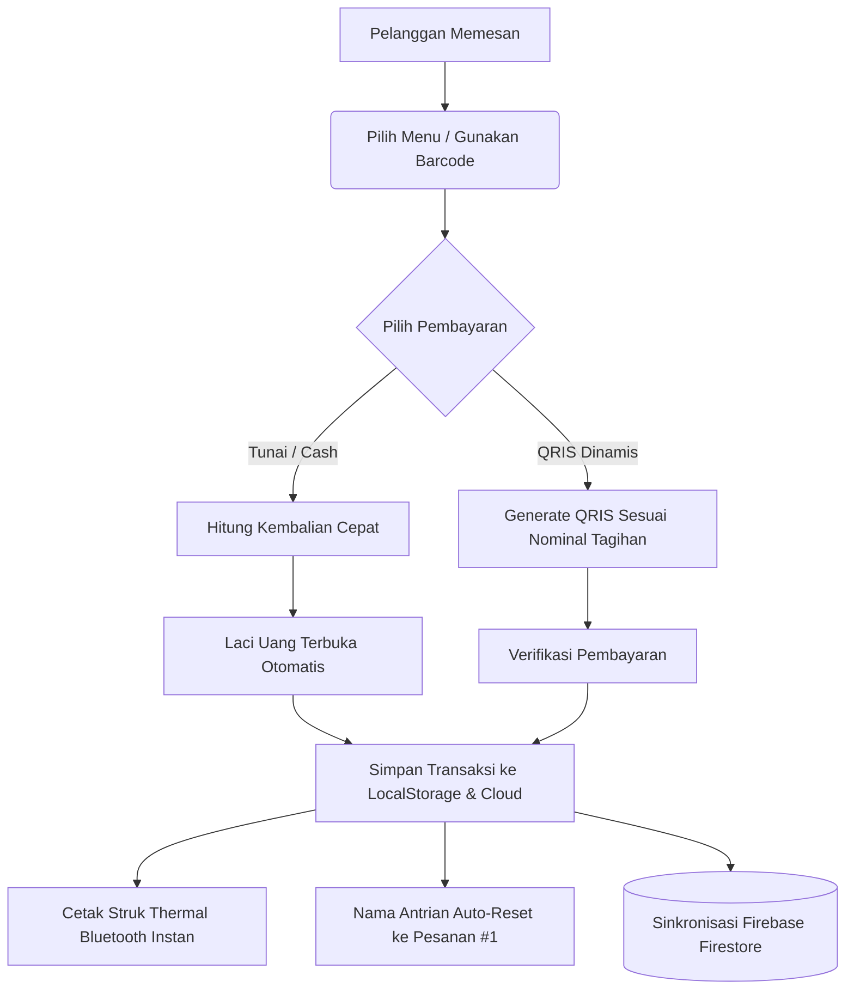

# 🎓 Aristotle POS (v1.1.0)
### *Sistem Kasir Pintar, Modern, dan Skalabel untuk UMKM Multi-Tenant*

[](https://github.com/miezlearning/umkm-prototype/releases)
[](file:///Aristotle-POS.apk)
[](file:///index.html)
[](file:///js/firebase.js)
[](file:///LICENSE)

**Aristotle POS** adalah aplikasi kasir (*Point of Sale*) multi-platform yang dirancang khusus untuk mempermudah operasional UMKM, warung makan, kedai kopi, dan bisnis retail. Dibangun dengan pendekatan **Hybrid Modern** (Web PWA + Native Android App), aplikasi ini ringan, bekerja 100% saat offline, dan otomatis tersinkronisasi ke cloud saat online.

---

## 🚀 Apa Saja yang Baru & Berubah di Versi 1.1.0?

Berikut rangkuman pembaruan penting dibandingkan versi awal (*Kedai Mami Prototype*):

### 1. 🎓 Rebranding & Maskot Resmi (Aristotle Scholar Cat)
* **Nama Resmi Aplikasi:** Berubah menjadi **Aristotle POS** (`com.aristotle.pos`) agar siap untuk ekspansi bisnis SaaS multi-merchant.
* **Ikon Maskot Transparan:** Menggunakan maskot kucing toga sarjana transparan 100% pada launcher Android (`ic_launcher`), layar splash pembuka, tab browser, serta favicon PWA.
* **UI/UX Header Rapi:** Bilah atas (*header*) ditata ulang menjadi satu baris sejajar yang bersih, dengan tombol bantuan WhatsApp terpisah di bilah kanan.

### 2. 🖨️ Cetak Bluetooth Instan (*Zero Dialog*) & Laci Kasir Otomatis
* **Bridge Native Android Bluetooth SPP:** Menggunakan socket RFCOMM native (`00001101-...`) sehingga kasir bisa mencetak struk langsung ke printer thermal Bluetooth (58mm/80mm) **tanpa aplikasi pihak ketiga (RawBT) dan tanpa watermark**.
* **Auto Kick Cash Drawer:** Laci kasir RJ-11 otomatis menyentak terbuka (*KLAK!*) setiap transaksi tunai selesai.
* **Bahasa Pengaturan Ringkas (Bebas Jargon TMI):** Menghapus seluruh nama merk/tipe hardware yang bertele-tele di menu pengaturan struk agar ramah pengguna non-teknis.

### 3. 📱 Smart External Link Interceptor (Integrasi WhatsApp Native)
* Tautan bantuan WhatsApp (`wa.me`) tidak lagi terbuka di dalam browser web internal aplikasi (*in-app WebView*), melainkan **langsung meluncurkan aplikasi WhatsApp resmi di HP Android**.
* Layar kasir tetap aktif di latar belakang tanpa tertutup atau ter-refresh saat kasir menghubungi bantuan.

### 4. 📋 Alur Antrian Pesanan Cepat (*Mobile Queue Renaming*)
* **One-Tap Rename:** Menambahkan tombol pensil (✏️) langsung di tab pesanan aktif untuk mengubah nama antrian di HP (misal: *Meja 05, Bungkus, Mas Yanto, GoFood*).
* **Auto-Reset Profesional:** Nama pesanan otomatis kembali ke **Pesanan #1** setelah pembayaran selesai atau saat keranjang dikosongkan.

### 5. 🤖 Otomatisasi CI/CD & GitHub Releases
* **Pipeline GitHub Actions:** Setiap push ke cabang `master` otomatis:
  1. Men-deploy web kasir terbaru ke GitHub Pages.
  2. Mengompilasi file native `Aristotle-POS.apk`.
  3. Mempublikasikan rilis resmi di GitHub Releases lengkap dengan changelog.
* **Auto-Increment Versioning:** `versionCode` dan `versionName` kini bertambah otomatis di setiap build, memastikan HP Android mengenali setiap APK baru sebagai pembaruan (*Update*) resmi tanpa konflik tanda tangan (*signature*).

### 6. 🛡️ Pengamanan Database & Anti-Stuck Failsafe
* **Inline Splash Failsafe:** Menambahkan timer pengaman 1.8 detik pada layar pembuka agar aplikasi dijamin tidak pernah tertahan (*stuck*) di layar loading, apapun kondisi sinyal HP kasir.
* **Pembatasan Domain (HTTP Referrer Restriction):** API Key dikunci di Google Cloud Console hanya untuk domain resmi dan aplikasi lokal, mencegah penyalahgunaan dari luar.

---

## ✨ Fitur Utama Aristotle POS

| Fitur | Deskripsi |
| :--- | :--- |
| **Multi-Antrian (*Order Queues*)** | Layani banyak meja/pesanan sekaligus tanpa risiko pesanan tertukar |
| **QRIS Dinamis Standar EMVCo** | Ubah QRIS statis toko menjadi QRIS dinamis otomatis dengan nominal tepat & validasi CRC |
| **Multi-Tenant & PIN Keamanan** | Satu aplikasi mendukung banyak toko/cabang terpisah dengan proteksi 4-digit PIN |
| **Realtime Cloud Sync** | Sinkronisasi instan antar HP kasir dan laptop owner menggunakan Firebase Firestore |
| **Offline-First Resilience** | Transaksi tetap berjalan normal tanpa internet; data tersimpan lokal dan sync saat online |
| **Laporan Finansial & Profit** | Rekap otomatis omzet, modal belanja, laba bersih, dan ekspor riwayat transaksi |
| **UI Lansia-Friendly** | Tombol sentuh besar, kontras tinggi, stepper porsi langsung di kartu menu, dan efek haptic audio |

---

## 🧭 Alur Kerja Sistem Kasir



---

## 📁 Struktur Proyek

```text
UMKM Mami/
├── index.html                   # Halaman utama POS, Laporan, Admin, & Modal UI
├── manifest.json                # Web App Manifest (PWA Homescreen Install)
├── sw.js                        # Service Worker untuk caching aset offline
├── Aristotle-POS.apk            # File installer native Android terbaru
├── android/                     # Proyek Native Android Studio (Java 17, SDK 34)
│   ├── app/build.gradle         # Konfigurasi appId, compileSdk, versionCode & signing
│   └── src/main/
│       ├── AndroidManifest.xml  # Izin Bluetooth, Kamera QRIS, & Akses File
│       ├── java/com/aristotle/pos/MainActivity.java  # WebView, SPP Bluetooth Bridge, Intent Routing
│       └── res/mipmap-*/        # Paket ikon maskot Android (MDPI s/d XXXHDPI)
├── css/
│   └── style.css                # Gaya kustom, cetak struk 58mm, & animasi modal
├── js/
│   ├── app.js                   # Orkestrator aplikasi & inisialisasi lifecycle
│   ├── state.js                 # State management lokal & antrian aktif
│   ├── config.js                # Pengaturan default & helper key storage
│   ├── firebase.js              # Integrasi Cloud Firestore & sinkronisasi realtime
│   ├── qris.js                  # Generator QRIS dinamis EMVCo
│   ├── utils.js                 # Format Rupiah, toast pemberitahuan, haptic audio
│   └── modules/
│       ├── pos.js               # Antrian pesanan, katalog produk, kalkulasi keranjang
│       ├── payment.js           # Checkout pembayaran, dialog cetak, reset antrian
│       ├── printer.js           # Driver Bluetooth SPP, ESC/POS generator, & cash drawer
│       ├── admin.js             # Pengelolaan produk, kategori menu, & kontrol stok
│       └── report.js            # Laporan keuangan, omzet, & laba rugi
└── .github/workflows/
    └── ci-cd.yml                # CI/CD otomatis untuk deploy Pages & build APK rilis
```

---

## 📲 Cara Instalasi & Menjalankan

### Cara 1: Pasang di HP Android (Aplikasi Native)
1. Unduh file **[Aristotle-POS.apk](file:///Aristotle-POS.apk)** langsung ke HP Android Anda.
2. Buka file APK dan izinkan instalasi dari sumber tidak dikenal jika diminta.
3. Buka aplikasi **Aristotle POS** di homescreen Anda.

### Cara 2: Buka di Browser (PWA)
Buka tautan rilis publik di browser HP / Laptop Anda:
```text
https://miezlearning.github.io/umkm-prototype/
```
*(Tekan **"Tambahkan ke Layar Utama" / "Install App"** di menu browser untuk menjadikan aplikasi desktop/HP)*

### Cara 3: Menjalankan di Lokal (Development)
Jalankan web server lokal sederhana (misal menggunakan Python):
```bash
python -m http.server 8000
```
Buka browser di `http://localhost:8000`.

---

## ⚡ Portal Super Admin (Monitoring Toko)

Untuk memantau performa seluruh UMKM mitra dari satu tempat:
* Akses URL: `https://domain.com/?view=superadmin`
* **Kemampuan Portal:**
  * Memantau omzet harian & jumlah transaksi seluruh UMKM secara terpusat.
  * Reset PIN toko jika mitra lupa.
  * Masuk ke kasir cabang manapun tanpa input PIN (*One-Click Impersonate*).

---

## ⌨️ Pintasan Keyboard Kasir (Desktop / Laptop)

| Tombol | Fungsi |
| :--- | :--- |
| <kbd>F2</kbd> | Tambah Antrian Pesanan Baru |
| <kbd>F4</kbd> | Buka Halaman Pembayaran (Checkout) |
| <kbd>Esc</kbd> | Tutup Jendela Modal / Batalkan Dialog |
| <kbd>Ctrl</kbd> + <kbd>P</kbd> | Cetak Ulang Struk Kasir |

---

## 📄 Lisensi

Hak Cipta © 2026 **Aristotle POS Team**.  
Dirilis di bawah lisensi [MIT License](file:///LICENSE). Bebas digunakan dan dikembangkan untuk memajukan UMKM Indonesia.
